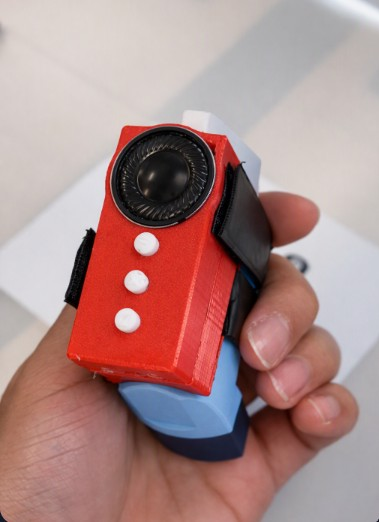
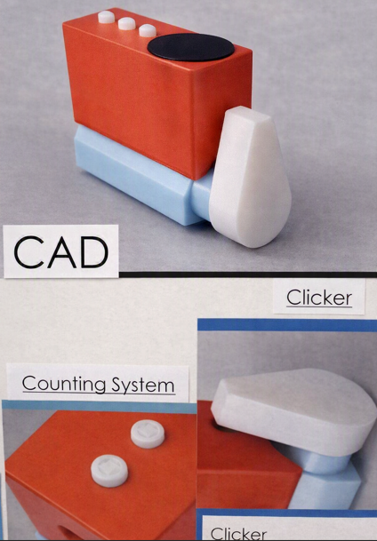
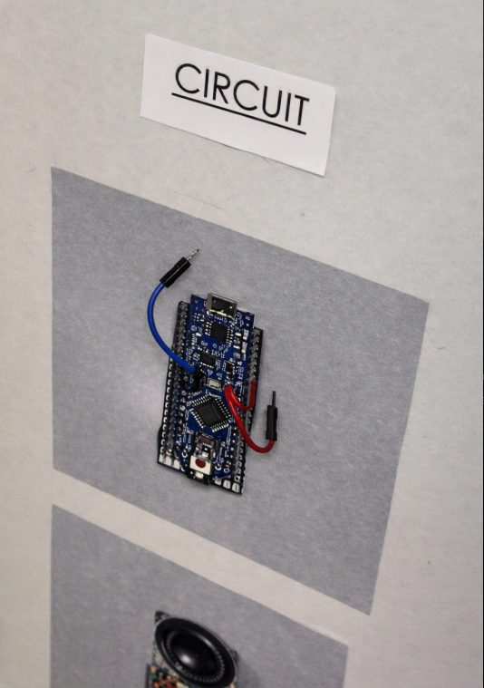

# Smart Inhaler Prototype

## Overview

This project documents a compact **smart inhaler prototype** developed for Western University’s **ES1050 Engineering Design Showcase**.

The device used an **Arduino Nano programmed in C++** to track inhaler usage and provide interactive feedback through **puff-count monitoring, voice alerts, and text-to-speech functionality**. The electronics were integrated into a custom-designed enclosure and presented as a functioning engineering prototype.

The project was **recognized for innovation** at the design showcase.

> **Note:** This was an educational engineering prototype and was not intended to function as a certified medical device.

---

## Prototype



The prototype combined embedded programming, physical user controls, audio feedback, and a compact enclosure into a single handheld device.

---

## Key Features

- **Puff tracking** to monitor inhaler usage
- **Usage-count monitoring** through embedded C++ logic
- **Physical button controls** for updating and resetting the usage count
- **Voice alerts** for user feedback
- **Text-to-speech functionality**
- **Compact custom enclosure**
- **Arduino Nano-based embedded control**
- Physical prototype built and demonstrated at an engineering design showcase

---

## Hardware & Software

| Category | Technology |
|---|---|
| Microcontroller | Arduino Nano |
| Programming | C++ / Arduino |
| Design | AutoCAD / CAD |
| User Input | Physical push buttons |
| User Feedback | Speaker / audio output |
| Enclosure | Custom prototype housing |
| Application | Smart inhaler usage tracking |

---

## How It Works

The Arduino Nano acts as the controller for the device.

The embedded program monitors physical button inputs and updates an internal usage count. The system can increment, decrement, reset, and report the stored count depending on the selected user input.

The prototype also provides audible feedback through voice-alert and text-to-speech functionality.

A simplified control flow is:

```text
User Input
    ↓
Arduino Nano
    ↓
Read Button State
    ↓
Update Puff / Usage Count
    ↓
Store Current Value
    ↓
Provide Audio / Voice Feedback
```

---

## CAD & Product Design



The enclosure was designed to package the inhaler, electronics, controls, and speaker into a compact handheld form.

The design process considered:

- component placement;
- user access to controls;
- inhaler fit;
- speaker positioning;
- overall device size;
- physical usability;
- prototype manufacturability.

---

## Circuit & Controller



The embedded system was built around an **Arduino Nano**, which handled the input logic, usage-count updates, and user-feedback functions.

---

## Showcase


The smart inhaler was presented at Western University’s **ES1050 Engineering Design Showcase** and was **recognized for innovation**.

The project demonstrated the integration of:

**embedded systems + C++ programming + CAD + physical prototyping + human-machine interaction**

---

## Demo Video

A short demonstration of the physical prototype is available here:

[Watch the Smart Inhaler Prototype Demo](video/smart_inhaler_demo.mp4)

---

## Repository Structure

```text
Smart-Inhaler-Prototype/
│
├── README.md
│
├── images/
│   ├── prototype_front.jpg
│   ├── prototype_side.jpg
│   ├── cad_display.jpg
│   ├── circuit.jpg
│   └── showcase.jpg
│
└── video/
    └── smart_inhaler_demo.mp4
```

---

## Engineering Skills Demonstrated

**Embedded Systems**
- Arduino Nano
- Digital inputs
- Button-state monitoring
- Embedded control logic
- Audio feedback

**Programming**
- C++
- Arduino programming
- State updates
- Input handling
- Debouncing logic

**Design & Prototyping**
- AutoCAD / CAD
- Product enclosure design
- Component integration
- Physical prototyping
- Engineering showcase presentation

---

## Engineering Lessons Learned

This project demonstrated how embedded electronics, software, and physical product design must work together in a compact system.

Key design considerations included:

- packaging electronics into a limited space;
- creating intuitive user controls;
- integrating hardware and software;
- maintaining reliable button input;
- communicating system status to the user;
- balancing functionality with physical usability.

---

## Future Improvements

Possible future improvements include:

- non-volatile storage so the usage count persists after power loss;
- a small display for real-time puff-count information;
- Bluetooth or Wi-Fi connectivity;
- battery-level monitoring;
- mobile-app integration;
- improved enclosure ergonomics;
- more robust sensor-based detection instead of manual usage inputs;
- expanded testing of reliability and user interaction.

---

## Summary

The **Smart Inhaler Prototype** combined an **Arduino Nano, C++ programming, physical controls, voice feedback, text-to-speech, CAD, and custom prototyping** into a compact embedded system.

The project was presented at Western University’s **ES1050 Engineering Design Showcase** and **recognized for innovation**, demonstrating practical experience in embedded-system development, hardware/software integration, and engineering product design.
